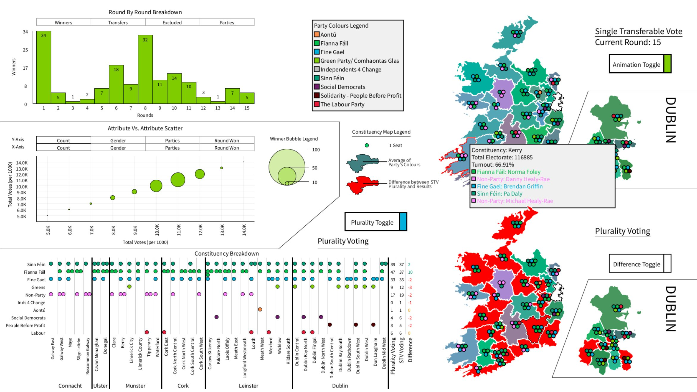

# Interactive Voting Dashboard

An interactive dashboard with animations to achieve the goal of facilitating an exploratory and explanatory round-by-round breakdown of Ireland’s last by-election, as well as an investigation into the effect that plurality voting might have in Ireland. This dashboard consists of five graphics, with 5 idioms, each highlighting a different aspect of the election process within Ireland or highlighting the difference that plurality voting might bring.

[Presentation Link:] (https://youtu.be/npCzmKqFPno)

[Artefact Link:] (https://www.youtube.com/watch?v=ggKwOiHGvwg)

Here is the final product

